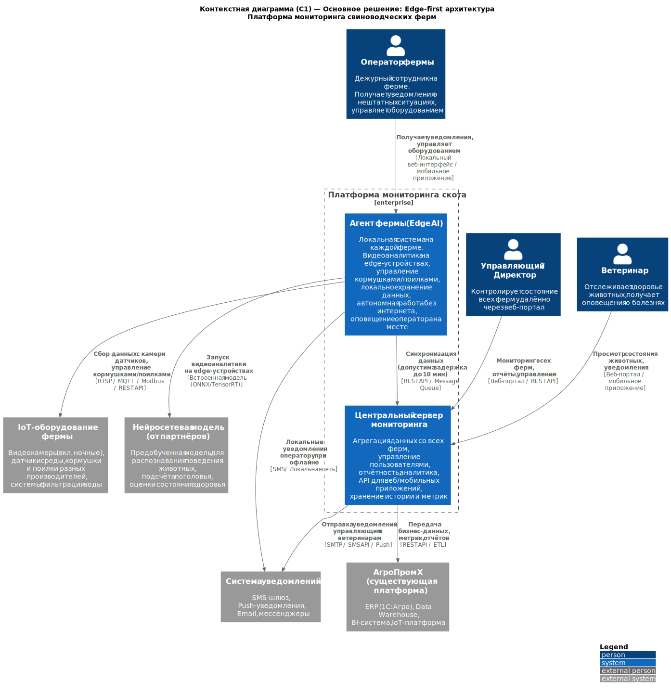
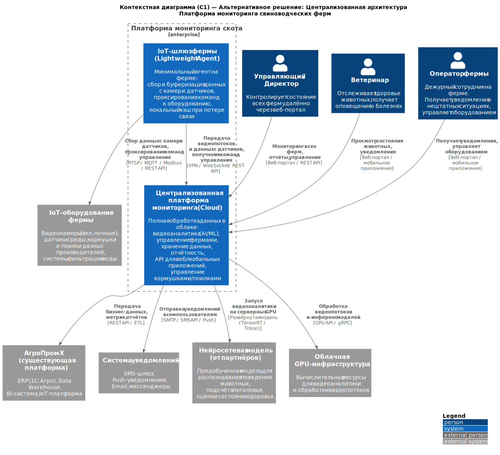

### **Название задачи:** Архитектура MVP платформы мониторинга свиноводческих ферм
### **Автор:** Архитектор
### **Дата:** 18.02.2026

---

### **Функциональные требования**

Верхнеуровневые Use Cases системы мониторинга свиноводческих ферм:

| **№** | **Действующие лица или системы** | **Use Case** | **Описание** |
| :-: | :- | :- | :- |
| 1 | Видеоаналитика (AI), Оператор фермы | Обнаружение нештатного поведения | Система с помощью камер и нейросети в реальном времени анализирует поведение животных. При обнаружении драк, беспокойства или задавливания поросят формируется оповещение оператору (< 5 секунд). |
| 2 | Видеоаналитика (AI), Ветеринар | Оценка состояния здоровья животных | Система по видеопотоку определяет признаки болезни, вялости, гибели животных. Ветеринар получает уведомление и может просмотреть данные через портал. |
| 3 | Видеоаналитика (AI), Система | Подсчёт поголовья | Система с помощью камер автоматически пересчитывает поголовье. Результаты сохраняются в хранилище и доступны в отчётах. |
| 4 | Оператор фермы, Система кормления | Управление кормушками и поилками | Оператор через интерфейс или автоматические правила управляет кормушками и поилками разных производителей. Система отслеживает расход корма и прогнозирует потребности. |
| 5 | Система, Датчики | Мониторинг фильтрации воды | Система получает данные с датчиков фильтрации воды, отслеживает состояние фильтров и оповещает при необходимости замены. |
| 6 | Система, Датчики | Мониторинг запасов корма | Система контролирует уровень запасов корма на ферме, рассчитывает прогноз расхода и оповещает при необходимости пополнения. |
| 7 | Управляющий / Директор | Удалённый мониторинг ферм | Управляющий через веб-портал контролирует состояние всех ферм: метрики, события, отчёты, состояние животных. |
| 8 | Агент фермы, Центральный сервер | Синхронизация данных | Агент фермы собирает данные локально и синхронизирует их с центральным сервером. Допустима задержка до 10 минут. При потере связи данные буферизуются и отправляются после восстановления. |
| 9 | Оператор фермы | Работа в офлайн-режиме | При отсутствии интернета система на ферме продолжает полноценно работать: видеоаналитика, управление оборудованием, локальные уведомления оператору. |
| 10 | Внешние системы | Предоставление метрик и API | Система предоставляет базовые метрики и API для интеграции с внешними системами (ERP, BI), а также для создания мобильных/веб-приложений. Поддерживается добавление собственных метрик. |
| 11 | Все пользователи | Аутентификация и авторизация | Система обеспечивает разделение ролей (оператор, управляющий, ветеринар) с современными способами аутентификации (OAuth 2.0 / OpenID Connect). |

---

### **Нефункциональные требования**

| **№** | **Требование** |
| :-: | :- |
| 1 | **Отказоустойчивость 99,95%** — система должна обеспечивать высокую доступность как на уровне центрального сервера, так и локальных агентов. |
| 2 | **Расширяемость** — возможность добавления нового функционала (новые типы датчиков, оборудования, аналитических моделей) без изменения существующего кода. Плагинная или микросервисная архитектура. |
| 3 | **Время оповещения < 5 секунд** — от момента фиксации нештатной ситуации видеоаналитикой до получения уведомления оператором. |
| 4 | **Реакция видеоаналитики в реальном времени (миллисекунды)** — обработка видеопотока нейросетью должна происходить с минимальной латентностью. |
| 5 | **Автономная работа при отсутствии интернета** — ферма должна продолжать полноценно функционировать без связи с центральным сервером. |
| 6 | **Допустимая задержка синхронизации до 10 минут** — между агентом фермы и центральным сервером (без учёта проблем со связью). |
| 7 | **Архитектура «центральный сервер — агенты»** — без ограничения количества подключаемых ферм-агентов. |
| 8 | **Поддержка оборудования разных производителей** — камеры, кормушки, поилки, датчики от различных вендоров. |
| 9 | **Альтернативные каналы связи** — на ферме нестабильный WiFi, необходимы резервные каналы (Ethernet, 4G/LTE). |
| 10 | **Безопасность** — шифрование данных при передаче, разделение ролей, современные протоколы аутентификации. |

---

### **Решение**

#### Основное решение: Edge-first архитектура с локальной видеоаналитикой

**Контекстная диаграмма (C1):** см. файл `c1_main.puml`

#### Описание основного решения

Архитектура построена по принципу **«центральный сервер — тяжёлые агенты на фермах»** с обработкой видеоаналитики непосредственно на edge-устройствах каждой фермы.

**Ключевые компоненты:**

1. **Агент фермы (Edge AI)** — локальная система, развёрнутая на каждой ферме:
   - Один центральный сервер фермы (edge-сервер с GPU, например NVIDIA Jetson или аналог) для запуска нейросетевой модели видеоаналитики.
   - Обработка видеопотоков от камер в реальном времени (миллисекунды) — распознавание поведения, подсчёт поголовья, оценка здоровья.
   - Управление кормушками, поилками и системами фильтрации воды через унифицированные адаптеры (поддержка разных производителей).
   - Локальная база данных для хранения событий, метрик и буферизации данных при отсутствии связи.
   - Локальные уведомления оператору (через веб-интерфейс в локальной сети, SMS-шлюз, звуковые сигналы).
   - Полная автономность: при потере интернета ферма продолжает работать без ограничений.
   - Альтернативные каналы связи: Ethernet как основной для внутренней сети, 4G/LTE как резервный для связи с центром.

2. **Центральный сервер мониторинга** — облачный или on-premise сервер компании:
   - Агрегация данных со всех ферм.
   - Единый веб-портал для управляющих и ветеринаров.
   - API для мобильных и веб-приложений (REST / WebSocket).
   - Хранение истории, построение отчётов и сводной аналитики.
   - Управление пользователями, ролями (OAuth 2.0 / OIDC).
   - Предоставление метрик для внешних систем (Prometheus-совместимые эндпоинты).
   - Интеграция с существующей платформой АгроПром Х (ERP, DWH, BI).

3. **Синхронизация агент ↔ центр:**
   - Периодическая отправка агрегированных данных (события, метрики, состояние поголовья).
   - Допустимая задержка до 10 минут.
   - При восстановлении связи — автоматическая досылка буферизованных данных.
   - Центр может рассылать обновления конфигурации и моделей на агентов.

**Логика принятия решения:**

- **Edge AI** выбран как основной подход, потому что требования жёстко определяют: реакция видеоаналитики в реальном времени (мс) и оповещение < 5 секунд. Передача видеопотоков на центральный сервер через нестабильный интернет не может гарантировать такие показатели.
- **Автономность** фермы — ключевое требование. При отсутствии интернета ферма должна работать полноценно, включая видеоаналитику и уведомления. Это возможно только при локальной обработке.
- **Масштабируемость без ограничений** на количество агентов: каждая ферма — самодостаточная единица, добавление новой фермы не нагружает центральный сервер обработкой видео.
- **Разные производители** оборудования — агент фермы включает абстракцию (адаптеры/плагины) для работы с устройствами разных вендоров.

---

### **Альтернативы**

#### Альтернативное решение: Централизованная архитектура с облачной видеоаналитикой

**Контекстная диаграмма (C1):** см. файл `c1_alternative.puml`

#### Описание альтернативного решения

Архитектура построена по принципу **«центральная облачная платформа — лёгкие IoT-шлюзы на фермах»** с обработкой видеоаналитики на GPU-серверах в облаке/ЦОД.

**Ключевые компоненты:**

1. **IoT-шлюз фермы (Lightweight Agent)** — минимальный агент на каждой ферме:
   - Сбор данных с камер и датчиков.
   - Передача видеопотоков в центральную платформу.
   - Буферизация данных при потере связи.
   - Проксирование команд управления оборудованием (кормушки, поилки).
   - Минимальные аппаратные требования (обычный мини-ПК без GPU).

2. **Централизованная платформа (Cloud):**
   - Вся обработка видеопотоков и инференс нейросетевых моделей на серверных GPU.
   - Единая точка управления, аналитики, уведомлений.
   - Веб-портал, API, управление пользователями.
   - Интеграция с АгроПром Х.

3. **Облачная GPU-инфраструктура:**
   - Выделенные GPU-серверы для параллельной обработки видеопотоков со всех ферм.
   - При масштабировании — автоскейлинг GPU-ресурсов.

**Преимущества альтернативы:**
- Дешевле оборудование на каждой ферме (не нужны edge-GPU).
- Проще обновление нейросетевых моделей — обновляется в одном месте.
- Централизованное управление и мониторинг всех потоков.
- Проще DevOps: один кластер вместо сотен edge-серверов.

---

### **Недостатки, ограничения, риски**

#### Риски основного решения (Edge-first):

| **Категория** | **Описание** |
| :- | :- |
| **Стоимость оборудования** | Каждая ферма требует edge-сервер с GPU (NVIDIA Jetson или аналог) — существенные капитальные затраты при масштабировании на 150+ ферм. |
| **Сложность обновления моделей** | Обновление нейросетевой модели нужно раскатывать на все агенты. Требуется механизм OTA-обновлений и контроль версий моделей. |
| **Обслуживание оборудования** | Edge-серверы с GPU на удалённых фермах сложнее обслуживать и ремонтировать. Нужен запас подменного оборудования. |
| **Сложность DevOps** | Управление сотнями edge-узлов требует зрелой инфраструктуры (Fleet Management, мониторинг, удалённый доступ). |

#### Риски альтернативного решения (Централизованное):

| **Категория** | **Описание** |
| :- | :- |
| **Зависимость от интернета** | Видеоаналитика работает только при наличии стабильного канала связи. При потере интернета — **нет распознавания событий**, оператор не получит уведомления. Это **прямое противоречие** требованию автономной работы. |
| **Задержка оповещений** | Передача видеопотока на сервер, обработка и отправка уведомления назад — суммарная задержка может **превысить 5 секунд**, особенно при нестабильном канале. Это **риск нарушения NFR**. |
| **Высокие требования к каналу связи** | Передача множества видеопотоков с каждой фермы (RTSP, H.264/H.265) требует стабильного широкополосного канала (десятки Мбит/с на ферму). На удалённых фермах это может быть недоступно или дорого. |
| **Стоимость облачных GPU** | Серверные GPU для обработки видеопотоков со всех ферм одновременно — значительные операционные расходы (OPEX), растущие с масштабом. |
| **Single point of failure** | Центральная платформа — единая точка отказа. При её недоступности все фермы теряют аналитику и управление. |

#### Обоснование выбора основного решения

Основное решение (Edge-first) выбрано, так как:

1. **Требование автономности** — критическое. Ферма должна работать без интернета, включая видеоаналитику. Это **невозможно** в централизованной архитектуре.
2. **Требование < 5 секунд** на оповещение и **реальное время для видеоаналитики** — гарантируется только при локальной обработке на edge-устройствах.
3. **Нестабильный WiFi** на фермах — передача видеопотоков в облако нереалистична без существенных инвестиций в каналы связи.
4. **Архитектура «сервер — агенты»** напрямую описана в требованиях, что подразумевает значимую функциональность на стороне агента.

**Компромиссы основного решения:**
- Принимаем повышенную стоимость edge-оборудования в обмен на гарантию автономности и низкой латентности.
- Принимаем сложность управления fleet-инфраструктурой — планируем использовать инструменты централизованного управления edge-устройствами (Ansible, K3s или аналоги).
- Обновление моделей реализуем через механизм OTA с постепенным раскатыванием и автоматическим откатом при ошибках.
- Для MVP ограничиваемся несколькими фермами, что снижает начальные затраты на оборудование и сложность управления.
