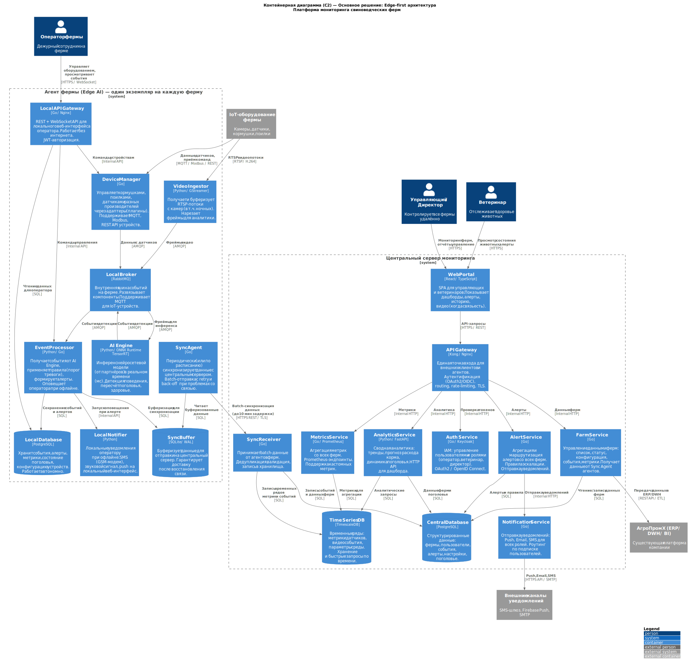
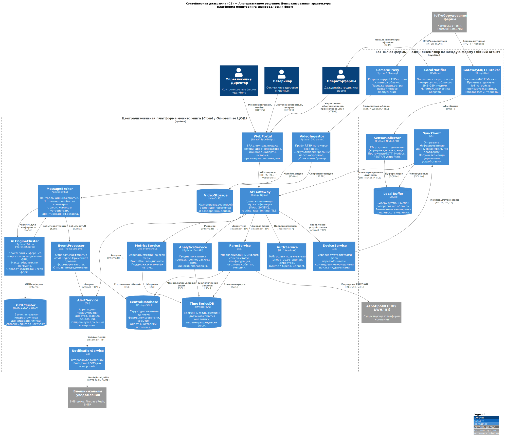

### **Название задачи:** Высокоуровневое видение архитектуры — контейнерные диаграммы C2
### **Автор:** Архитектор
### **Дата:** 18.02.2026

---

### **Ограниченные контексты (Bounded Contexts)**

После анализа функциональных требований выделены следующие ограниченные контексты, которые станут основой для микросервисов:

| **Контекст** | **Ответственность** | **Ключевые сущности** |
| :- | :- | :- |
| **Video & AI** | Приём видеопотоков, инференс нейросетей, детекция событий | VideoStream, Frame, DetectionEvent |
| **Device Management** | Управление оборудованием разных производителей через адаптеры | Device, Adapter, Command, Telemetry |
| **Event & Alert** | Обработка событий, применение правил, формирование алертов | Event, Alert, Rule, Escalation |
| **Animal Monitoring** | Поголовье, здоровье, поведение | HeadCount, HealthStatus, BehaviorLog |
| **Feed & Water** | Управление кормлением, запасы корма, фильтрация воды | FeedLevel, Ration, WaterFilter, ConsumptionForecast |
| **Farm Management** | Данные ферм, конфигурация, статус | Farm, Barn, Configuration |
| **Sync & Connectivity** | Синхронизация агент↔центр, офлайн-буферизация | SyncBatch, SyncStatus, Buffer |
| **Identity & Access** | Пользователи, роли, аутентификация, авторизация | User, Role, Token, Permission |
| **Notification** | Отправка уведомлений по всем каналам | Notification, Channel, Subscription |
| **Analytics & Metrics** | Сводная аналитика, прогнозы, метрики, интеграция с BI | Metric, Trend, Forecast, Report |

---

### **Решение**

#### Основное решение: Edge-first архитектура

**Контейнерная диаграмма (C2):** см. файл `c2_main.puml`

**Структура системы:**

Архитектура разбита на два уровня: **Агент фермы** (Edge AI) и **Центральный сервер мониторинга**.

##### Агент фермы — контейнеры

| **Контейнер** | **Технология** | **Ограниченный контекст** | **Обоснование** |
| :- | :- | :- | :- |
| Video Ingestor | Python / GStreamer | Video & AI | GStreamer — промышленный стандарт для работы с видеопотоками RTSP, поддерживает аппаратное ускорение H.264/H.265 декодирования |
| AI Engine | Python / ONNX Runtime + TensorRT | Video & AI | ONNX Runtime — унифицированный формат моделей, TensorRT — максимальная производительность на NVIDIA GPU (необходима для латентности в мс) |
| Event Processor | Python / Go | Event & Alert, Animal Monitoring | Лёгкий, быстрый, обрабатывает поток событий от AI Engine, применяет правила алертов |
| Device Manager | Go | Device Management | Go — высокая производительность, малый footprint, отлично для embedded/edge; плагинная архитектура адаптеров для разных производителей |
| Local API Gateway | Go / Nginx | Farm Management | REST + WebSocket для локального интерфейса оператора, работает без интернета |
| Local Database | PostgreSQL | Все контексты на ферме | PostgreSQL — надёжная СУБД с хорошей поддержкой JSON для гибкого хранения событий |
| Sync Buffer | SQLite / WAL | Sync & Connectivity | SQLite с WAL-журналом — надёжная буферизация без отдельного процесса, минимальные ресурсы |
| Local Broker | RabbitMQ | Внутренняя шина событий | Поддерживает MQTT для IoT-устройств, прост в развёртывании, не требователен к ресурсам, достаточен для нагрузки одной фермы |
| Sync Agent | Go | Sync & Connectivity | Периодическая batch-отправка данных, retry с exponential back-off |
| Local Notifier | Python | Notification | Локальные оповещения при офлайне: GSM SMS, звук, push в локальную сеть |

##### Центральный сервер — контейнеры

| **Контейнер** | **Технология** | **Ограниченный контекст** | **Обоснование** |
| :- | :- | :- | :- |
| API Gateway | Kong / Nginx | Инфраструктура | Единая точка входа, OAuth2/OIDC аутентификация, rate-limiting, TLS-терминация |
| Auth Service | Go / Keycloak | Identity & Access | Keycloak — зрелое IAM-решение с OAuth2/OIDC из коробки; Go для кастомной логики |
| Sync Receiver | Go | Sync & Connectivity | Принимает batch-данные от агентов, дедупликация, валидация, запись в хранилища |
| Farm Service | Go | Farm Management | CRUD ферм, агрегация данных, интеграция с ERP |
| Alert Service | Go | Event & Alert | Агрегация алертов со всех ферм, правила эскалации |
| Analytics Service | Python / FastAPI | Analytics & Metrics | Python — богатая экосистема ML/аналитики (pandas, scikit-learn для прогнозов) |
| Notification Service | Go | Notification | Маршрутизация по каналам (Push/Email/SMS), подписки |
| Metrics Service | Go / Prometheus | Analytics & Metrics | Prometheus-совместимые эндпоинты, поддержка кастомных метрик |
| Web Portal | React / TypeScript | UI | SPA — быстрый отзывчивый интерфейс, WebSocket для real-time обновлений |
| Central Database | PostgreSQL | Все сервисы центра | Транзакционное хранилище для структурированных данных |
| Time Series DB | TimescaleDB | Analytics & Metrics | Расширение PostgreSQL для временных рядов — быстрые запросы по диапазонам, агрегации |

##### Интеграции и обоснование технологий

**Внутренняя шина агента — RabbitMQ:**
- Поддерживает MQTT — нативный протокол IoT-устройств.
- Лёгкий, не требователен к ресурсам на edge-сервере.
- Достаточен для нагрузки одной фермы (десятки камер, сотни датчиков).
- Надёжная доставка сообщений (ACK, DLQ).
- _Компромисс:_ при нагрузке свыше нескольких тысяч событий/сек лучше использовать Kafka. Для одной фермы это ограничение не актуально.

**Синхронизация агент↔центр — HTTPS REST batch:**
- Простой и надёжный механизм: агент накапливает данные и отправляет батчами.
- Нет постоянного соединения — устойчиво к нестабильности сети.
- Retry с back-off обеспечивает гарантированную доставку.
- _Компромисс:_ не real-time синхронизация (до 10 минут задержки) — допустимо по требованиям.

**PostgreSQL + TimescaleDB:**
- Единая технология (расширение), упрощает эксплуатацию.
- TimescaleDB эффективен для временных рядов метрик и событий.
- _Компромисс:_ при очень большом масштабе (1000+ ферм) может потребоваться ClickHouse.

---

### **Альтернативы**

#### Альтернативное решение: Централизованная архитектура

**Контейнерная диаграмма (C2):** см. файл `c2_alternative.puml`

**Структура системы:**

Архитектура разбита на два уровня: **IoT-шлюз фермы** (лёгкий агент) и **Централизованная платформа** (Cloud/ЦОД).

##### IoT-шлюз фермы — контейнеры

| **Контейнер** | **Технология** | **Обоснование** |
| :- | :- | :- |
| Camera Proxy | Python / FFmpeg | Ретрансляция RTSP-потоков в облако, пересжатие при низкой полосе |
| Sensor Collector | Python / Node-RED | Сбор IoT-данных, визуальное программирование для разных производителей |
| Gateway MQTT Broker | Mosquitto | Лёгкий MQTT-брокер, локальный буфер команд при потере связи |
| Local Buffer | SQLite | Буферизация телеметрии при потере связи |
| Sync Client | Go | Отправка в облако, получение команд, retry-логика |
| Local Notifier | Python | Минимальный офлайн-оповещатель (SMS оператору) |

##### Централизованная платформа — контейнеры

| **Контейнер** | **Технология** | **Обоснование** |
| :- | :- | :- |
| Video Ingestor | Python / GStreamer | Централизованный приём всех RTSP-потоков |
| AI Engine Cluster | Python / NVIDIA Triton | Triton Inference Server — промышленный стандарт для кластерного инференса, поддерживает ONNX, TensorRT, автоскейлинг |
| GPU Cluster | NVIDIA A100/H100 | Высокопроизводительные GPU для параллельной обработки видео всех ферм |
| Message Broker | Apache Kafka | Высокопроизводительная шина для потоков видеособытий и телеметрии от многих ферм. Горизонтально масштабируется. |
| Event Processor | Go / Kafka Streams | Stream-обработка событий в реальном времени |
| Video Storage | MinIO (S3) | S3-совместимое объектное хранилище для видеозаписей |
| Central Database | PostgreSQL | Транзакционное хранилище |
| Time Series DB | TimescaleDB | Временные ряды всех ферм |

##### Интеграции централизованного решения

**Apache Kafka вместо RabbitMQ:**
- Необходима для централизованной обработки потоков от множества ферм (высокая пропускная способность).
- Горизонтально масштабируется.
- Kafka Streams позволяет писать stream-процессоры прямо над топиками.
- _Компромисс:_ сложнее в эксплуатации, требует ZooKeeper/KRaft, выше порог входа.

**NVIDIA Triton Inference Server:**
- Промышленный стандарт для кластерного GPU-инференса.
- Поддерживает динамическое батчирование (объединяет фреймы с разных ферм в один батч).
- Автоскейлинг под нагрузку.
- _Компромисс:_ дорогостоящая GPU-инфраструктура, OPEX растёт с количеством ферм.

**RTSP через интернет:**
- Видеопоток передаётся через VPN-туннель или WebRTC.
- _Компромисс:_ требует стабильного широкополосного канала (10–50 Мбит/с на ферму). На удалённых фермах с нестабильным WiFi и 4G — высокий риск потери видео и нарушения SLA.

---

### **Недостатки, ограничения, риски**

#### Риски основного решения (Edge-first):

| **Категория** | **Описание** | **Митигация** |
| :- | :- | :- |
| **Стоимость edge-GPU** | NVIDIA Jetson Orin (от ~$500) или аналог на каждую ферму — значительные CAPEX при масштабировании | Начинаем с MVP на нескольких фермах; окупается экономией на облачных GPU и каналах связи |
| **OTA-обновления моделей** | Раскатка новых версей нейросетей на все edge-устройства требует Fleet Management | Используем k3s/Ansible + staged rollout с автооткатом при ошибках |
| **Сложность DevOps** | Управление гетерогенным парком edge-устройств на удалённых фермах | Централизованный мониторинг (Prometheus + Grafana), remote SSH через VPN |
| **Аппаратные отказы** | Edge-сервер с GPU может выйти из строя | Горячий резерв (ещё один сервер), мониторинг состояния железа |

#### Риски альтернативного решения (Централизованная):

| **Категория** | **Описание** | **Критичность** |
| :- | :- | :- |
| **Нарушение NFR: офлайн** | Без интернета видеоаналитика не работает, оператор не получит алерт о драке или задавливании | **Критично** — прямое нарушение требования |
| **Нарушение NFR: < 5 секунд** | Передача видео + инференс + возврат алерта через сеть с нестабильным каналом может превысить 5 секунд | **Критично** — риск нарушения NFR |
| **Стоимость GPU OPEX** | Серверные GPU для всех ферм — постоянные операционные затраты, растущие с масштабом | Высокая |
| **Пропускная способность** | 10–50 Мбит/с на ферму для видеопотоков — недоступно на многих удалённых площадках | Высокая |

#### Обоснование выбора основного решения (компромиссы)

Основное решение (Edge-first) принято потому, что:

1. **Офлайн-работа** — единственный способ выполнить требование — локальная обработка на ферме. Централизованное решение это требование **нарушает**.
2. **Латентность** — ONNX/TensorRT на локальном GPU обрабатывает кадр за 10–50 мс. Время цикла алерта: инференс + event processing + local notification = 1–3 секунды. Требование < 5 сек выполняется с запасом.
3. **Нестабильная сеть** — не является ограничением для Edge-first: ферма работает автономно, синхронизирует данные батчами при наличии связи.

**Зафиксированные компромиссы:**
- Принимаем повышенный CAPEX на edge-GPU ради автономности и низкой латентности.
- Принимаем сложность OTA-обновлений — решаем через Fleet Management с staged rollout.
- Принимаем RabbitMQ вместо Kafka на агенте — достаточно для нагрузки одной фермы, при необходимости можно заменить без изменения контрактов.
- Принимаем TimescaleDB (надстройка над PostgreSQL) вместо ClickHouse — достаточно для MVP, при росте до 1000+ ферм пересмотреть в пользу ClickHouse.
