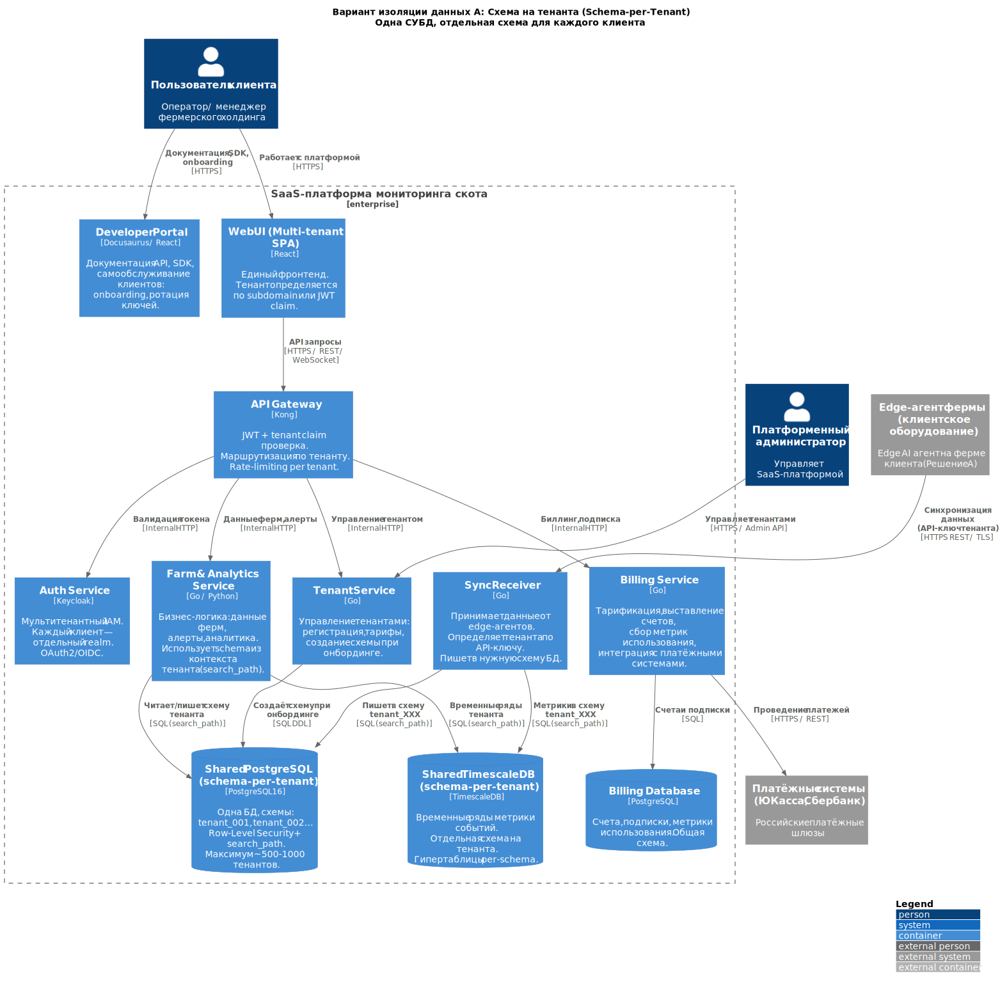
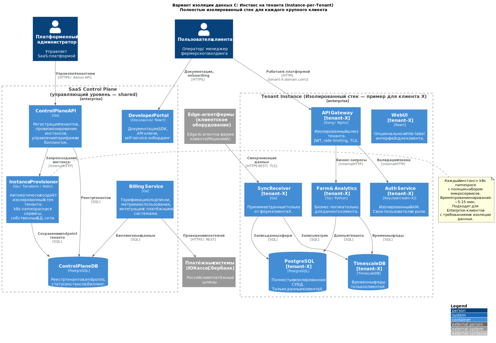
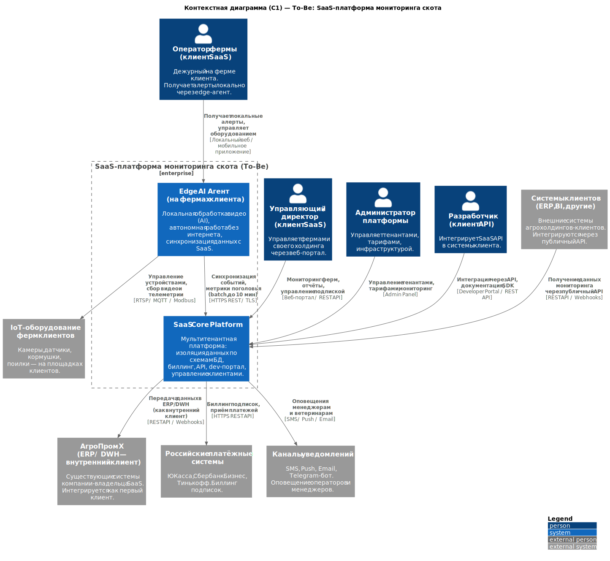
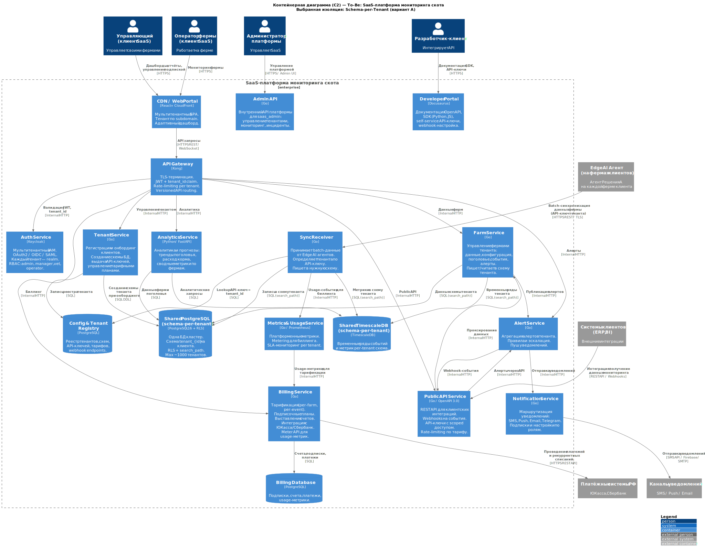
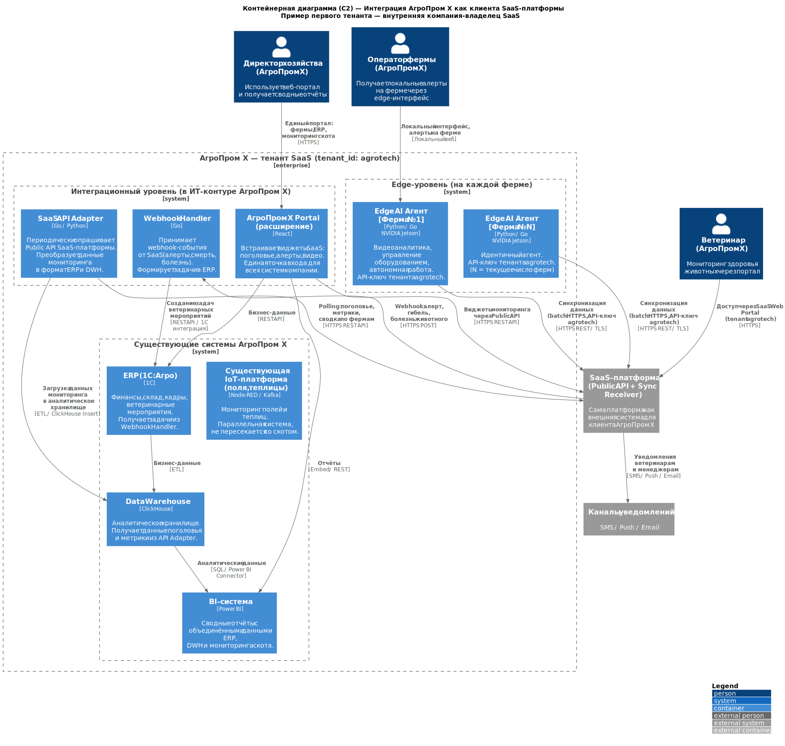

### **Название задачи:** Проектирование эволюции MVP в SaaS-платформу мониторинга скота
### **Автор:** Архитектор
### **Дата:** 18.02.2026

---

### **Ссылка на принятое решение**

Данный ADR опирается на **Решение А (Edge-first архитектура)**, выбранное в [Task4/adr.md](../Task4/adr.md) как единственный вариант, соответствующий критическим NFR: автономная работа без интернета, оповещение < 5 секунд, реалтайм видеоаналитика.

SaaS-платформа расширяет Решение А, добавляя мультитенантность, биллинг, публичный API и dev-портал.

---

## Задача 1. Мультитенантная архитектура

### Варианты изоляции данных

Проработаны три варианта изоляции данных между клиентами.

---

#### **Вариант A: Schema-per-Tenant (схема на тенанта)**

**Диаграмма:** см. `c2_isolation_schema.puml`

**Описание:** Одна СУБД, для каждого клиента создаётся отдельная схема (`tenant_001`, `tenant_002`, …). Маршрутизация запросов через `search_path` или Row-Level Security.

---

#### **Вариант B: DB-per-Tenant (база данных на тенанта)**

**Диаграмма:** см. `c2_isolation_database.puml`

**Описание:** Один кластер СУБД, для каждого клиента — отдельная база данных (`db_tenant_001`, …). Динамическое подключение через connection pool. Отдельный Tenant Registry хранит connection strings.

---

#### **Вариант C: Instance-per-Tenant (инстанс на тенанта)**

**Диаграмма:** см. `c2_isolation_instance.puml`

**Описание:** Для каждого клиента развёртывается полностью изолированный стек микросервисов и СУБД (отдельный k8s namespace). Общий Control Plane управляет провизионированием.

---

### Сравнительный анализ вариантов изоляции

| **Критерий** | **A: Schema-per-Tenant** | **B: DB-per-Tenant** | **C: Instance-per-Tenant** |
| :- | :-: | :-: | :-: |
| **Изоляция данных** | Средняя (одна БД, RLS) | Высокая (отдельная БД) | Максимальная (отдельный стек) |
| **Утечка данных при ошибке** | Риск при неверном search_path | Практически исключён | Исключён |
| **Макс. число тенантов** | ~500–1000 | ~3000–5000 | Неограничено, но дорого |
| **CAPEX / OPEX на тенанта** | Минимальный | Низкий | Высокий (целый стек) |
| **Время онбординга** | Секунды (CREATE SCHEMA) | Секунды (CREATE DATABASE) | 5–15 минут (k8s provisioning) |
| **Резервное копирование** | Сложно (одна БД) | Просто (pg_dump per DB) | Просто (per namespace) |
| **Соответствие 152-ФЗ / GDPR** | Потребует доп. аудита | Соответствует при настройке | Полное соответствие |
| **Сложность разработки** | Низкая (один pool) | Средняя (dynamic conn) | Высокая (fleet management) |
| **Подходит для SaaS MVP** | ✅ Да | ✅ Да | ⚠️ Enterprise-only |

### Рекомендация по изоляции

**Выбран вариант A (Schema-per-Tenant)** для MVP с возможностью миграции на B при росте.

**Обоснование:**
- Для MVP: ожидаемое число тенантов — до 50–100 агрохолдингов. Вариант A полностью покрывает потребности.
- Простейший онбординг (секунды) — важно для SaaS-модели.
- Минимальные затраты на инфраструктуру.
- Риск утечки данных митигируется через RLS + тестирование + code reviews.
- При росте до 500+ тенантов: миграция на B с минимальными изменениями бизнес-логики (только слой подключения к БД).
- Вариант C — зарезервирован для Enterprise-клиентов с жёсткими требованиями к изоляции (по отдельному договору).

**Компромисс:** принимаем несколько меньшую изоляцию вместо простоты разработки и низких затрат для MVP.

---

## Задача 2. Система биллинга и монетизации

### Тарифные планы

| **Тариф** | **Фермы** | **Камеры/ферму** | **API-запросы/мес** | **Биллинг** |
| :- | :-: | :-: | :-: | :- |
| **Старт** | до 3 | до 4 | 10 000 | Фиксированная подписка |
| **Бизнес** | до 20 | до 16 | 100 000 | Подписка + overage |
| **Агрохолдинг** | до 100 | до 32 | Безлимит | Подписка + per-farm цена |
| **Enterprise** | Неограничено | Неограничено | Неограничено | Индивидуальный договор |

### Биллинговые метрики (Metering)

Billing Service собирает следующие метрики использования:

| **Метрика** | **Единица** | **Используется в тарифе** |
| :- | :- | :- |
| Число активных ферм | ферма/месяц | Все тарифы |
| Число камер | камера/месяц | Все тарифы |
| Количество событий | событие/месяц | Бизнес + |
| API-запросы | запрос/месяц | Бизнес + |
| Объём хранилища данных | ГБ/месяц | Агрохолдинг + |
| Webhook-доставки | доставка/месяц | Бизнес + |

### Интеграция с российскими платёжными системами

| **Система** | **Тип** | **Интеграция** | **Использование** |
| :- | :- | :- | :- |
| **ЮКасса (YooKassa)** | Эквайринг + рекуррентные платежи | REST API + webhooks | Подписки для SMB-клиентов (Старт, Бизнес) |
| **Сбербанк Бизнес** | Расчётный счёт + B2B платежи | REST API | Enterprise-клиенты, выставление счетов |
| **Тинькофф** | Эквайринг | REST API | Альтернативный эквайринг |

**Схема рекуррентного биллинга (ЮКасса):**
1. При регистрации клиент привязывает карту через ЮКасса → сохраняется `payment_method_id`.
2. Ежемесячно Billing Service формирует счёт на основе Usage Metrics.
3. Запрос на списание через ЮКасса API с сохранённым `payment_method_id`.
4. Webhook от ЮКасса подтверждает успех/неудачу → обновление статуса в Billing DB.
5. При неудаче: 3 попытки с интервалом, затем — приостановка доступа + уведомление.

---

## Задача 3. Интеграции с клиентами

### Публичный API (scope функционала)

**Базовый URL:** `https://api.agrovet-monitor.ru/v1/`

**Аутентификация:** API-ключ (`X-API-Key: <key>`) или OAuth2 Bearer Token.

| **Endpoint** | **Метод** | **Описание** | **Тариф** |
| :- | :-: | :- | :- |
| `/farms` | GET | Список ферм тенанта | Все |
| `/farms/{id}/headcount` | GET | Текущее поголовье и история | Все |
| `/farms/{id}/alerts` | GET | Алерты фермы (фильтр по типу/времени) | Все |
| `/farms/{id}/metrics` | GET | Метрики датчиков (временной ряд) | Бизнес+ |
| `/animals/{id}/health` | GET | История здоровья животного | Бизнес+ |
| `/webhooks` | GET/POST/DELETE | Управление webhook-подписками | Бизнес+ |
| `/usage` | GET | Метрики использования для собственного биллинга | Все |
| `/custom-metrics` | POST | Добавление собственных метрик | Агрохолдинг+ |

### Webhooks (события)

| **Событие** | **Описание** |
| :- | :- |
| `alert.fight` | Обнаружена драка между животными |
| `alert.piglet_crushing` | Обнаружено задавливание поросёнка |
| `alert.animal_death` | Обнаружена гибель животного |
| `alert.illness_suspected` | Подозрение на болезнь |
| `headcount.anomaly` | Аномалия в пересчёте поголовья |
| `feed.low` | Низкий уровень запасов корма |
| `water_filter.warning` | Требуется обслуживание фильтра |
| `farm.offline` | Ферма потеряла связь с SaaS > 30 минут |

### Developer Portal

Developer Portal (Docusaurus) предоставляет клиентам:

- **OpenAPI 3.0 документация** — интерактивный Swagger UI для тестирования API прямо в браузере.
- **SDK** — готовые клиентские библиотеки: `Python`, `JavaScript/TypeScript`, `Go`.
- **Quickstart Guide** — пошаговая инструкция за 15 минут: регистрация → API-ключ → первый запрос.
- **Webhook Guide** — настройка endpoint-получателя, верификация подписи (HMAC-SHA256).
- **Self-service панель** — ротация API-ключей, управление webhook-подписками, просмотр usage-метрик без обращения в поддержку.
- **Changelog** — история изменений API с политикой версионирования (минимум 12 месяцев поддержки версии).

---

## Задача 4. Финальная архитектура To-Be

### C1 — Финальная SaaS-платформа

**Диаграмма:** см. `c1_saas_tobe.puml`

### C2 — Финальная SaaS-платформа (контейнерная)

**Диаграмма:** см. `c2_saas_tobe.puml`

### C2 — Интеграция АгроПром Х как клиента SaaS

**Диаграмма:** см. `c2_agrotech_integration.puml`

---

### Ключевые архитектурные решения To-Be

| **Решение** | **Обоснование** |
| :- | :- |
| **Schema-per-Tenant** | Минимальные затраты для MVP, достаточная изоляция для 100 тенантов, простой онбординг (секунды) |
| **Keycloak multi-realm** | Полная изоляция аутентификации и ролей между тенантами; зрелое open-source решение |
| **ЮКасса как основной эквайринг** | Поддержка рекуррентных платежей, compliance с российским законодательством, REST API |
| **Edge AI агент без изменений** | Решение А остаётся неизменным на уровне фермы — только добавляется привязка к тенанту через API-ключ |
| **Public API + Webhooks** | Позволяет клиентам интегрировать мониторинг в собственные ERP/BI без доступа к исходным видеоданным |
| **Developer Portal на Docusaurus** | Быстрое развёртывание, Markdown-контент, интеграция с OpenAPI, статический хостинг (минимум OPEX) |

---

### Недостатки, ограничения, компромиссы

| **Ограничение** | **Описание** | **Митигация** |
| :- | :- | :- |
| **Schema-per-Tenant: лимит ~1000 тенантов** | При большом числе схем производительность PostgreSQL снижается | При достижении 500 тенантов — плановая миграция на DB-per-Tenant |
| **Нет Admin UI** | Требования указывают: пока нет специального интерфейса администратора | Admin API (REST) достаточен для MVP; Admin UI — следующий этап |
| **Видео не передаётся в SaaS** | Видеозаписи инцидентов хранятся локально на ферме | По запросу клиента — экспорт видеофрагментов через отдельный механизм (вне scope MVP) |
| **GDPR / 152-ФЗ при Schema-per-Tenant** | Данные в одной СУБД — потребуется аудит на соответствие | RLS + аудит запросов; для Enterprise — предложить вариант C |
| **Время первого платежа** | ЮКасса может задержать первый платёж на проверку 1–3 дня | Предусмотреть grace period при регистрации нового клиента |
